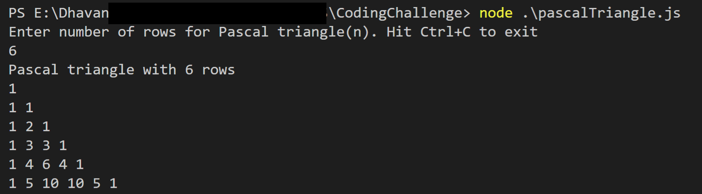

# Code challenge-Pascal Triangle
Javascript code for Pascal triangle formation

**Overview**

This repo consists of a Javascript logic to display Pascal triangle based on total rows inputted by user.

---

**Pre-requisites**

Nodejs installed on machine

---

**Steps to run the code**

1. Clone the repo via [link](https://github.com/dhavans1/codeChallenge-pascalTriangle.git), or download Zip

2. After cloning, open up Command prompt or terminal and traverse to directory where the repo is located

3. Type-in command `node .\pascalTriangle.js`

4. On successful execution, you will be prompted to input number of rows of Pascal triangle you like to see

---

**Notes**

1. Implementation logic uses combination formula `n!/(k!*(n-k)!` wherein n is row and k is column of triangle.
2. All known exceptions are handled to the best of my knowledge. If I have missed any, please feel free to update or notify me.
